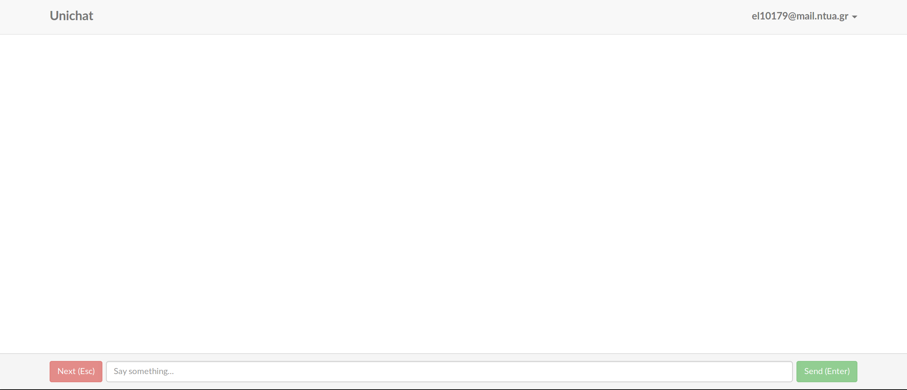

# Unimeet User Experience

## Pages

The frontend consists of two main dynamic pages and multiple static pages. The
common component across all pages is the topbar that contains the Unimeet logo
on the left and a navigation menu on the right when necessary.

### Welcome

The welcome page is the default home page for a logged-out user. It contains
forms for logging-in and signing-up, as well as links for the static pages. It
communicates only with the registrar module in order to complete a user login or
signup.

The navigation menu is an inline form with two input fields, a text field for
the username and a password field for the password, and a button for logging in.
Below the password field is a hyperlink text for launching the forgot password
functionality.

When the user clicks on the forgot password link a modal is displayed as shown
below. The modal should contain an explanatory message, a field for the user's
email and a submit button. When the user submits his email the input fields
should be disabled while the request is processed and, when complete, both the
input fields and the message will be replaced by a different message that
explains the next necessary steps.

When the user clicks on the login button the input fields and the button become
disabled until either the user is logged in and redirected to the chat page or
the credenctials are denied. In the latter case, a message is displayed
informing the user that its credentials were not accepted.

The page's main body is separated in two columns with a common background. The
background is an image of a man and a woman sitting together looking at their
devices. The left column contains an introduction welcome message and a few
bullets that briefly explain what Unimeet is. The right column contains a form
for signing up which consists of a header message, under which is an input field
for the user's email and a button under that. When the user clicks on the
sign up button, both the button and the input field become disabled until his
request has been processed, at which point a modal is displayed with an
informational message as below.

The page's footer has bullet-separated links to the static pages on its left and
the brandname/license information to the right.

### Chat

The chat page is the core page of Unimeet. It is the default page for a
logged-in user where he is able to chat, wait while searching for a match, or
change his preferences and account settings.

The navigation menu is a dropdown menu that has the user's email address as the
header. When the user clicks on the dropdown the menu appears, which has the
settings and help fields separated by a separator from the logout field that is
at the bottom, as displayed below.

When the user clicks on the settings field, a modal is displayed. The modal
contains a navigation menu on the left for the different settings areas, the
first being selected by default, and the content of the settings of the selected
area on the right. The selected area is distinguished from the inactive ones by
a different color. The setting for the "Interested in" options can be seen
below.

When the user clicks on the help field of the dropdown menu, a modal is
displayed. The modal contains buttons in its body that are arranged in a grid,
each button linking to one of the static pages. The modal's footer contains the
brand/license information.

The body of the chat page contains the messages that have been exchanged. The
user's messages are positioned on the right, while the partner's are positioned
on the left. Each message is displayed in a box, the partner's messages' boxes
having different background color than the user's. Next to the message's box, on
the outer side, is an icon that represents each user's gender (the venus symbol
for women, the mars symbol for men, and a simple circle for undefined).

The footer of the page contains an inline form for communicating. The form
contains a button for changing partner, an input text field for writing a
message and a button for sending the message. The message can be sent either by
pressing Enter or clicking on the right button. Empty messages are ignored. The
user can change partner by either pressing Esc or clicking on the Next button on
the right. The Next and the Send button have different colors. The footer
buttons are only enabled if the use can chat with a partner. In all other cases
(eg when searching for a match or server disconnection) the buttons are
disabled. The input text field is autofocused when the page is loaded.

### F.A.Q.

The F.A.Q. page is a static page that contains useful information as to what is,
how somebody can use or sign to, and what options a user has when using Unimeet.

### Security

The security page is a static page focused on explaining the security model of
Unimeet. It should describe the security of the communication protocols between
all modules, both backend and frontend, and the operations security of the
backend in terms of privacy, anonymity, and personal information security.

### Contact

The contact page is a page that allows anybody, either being a user of Unimeet
or not, to submit a message to the Unimeet dev team.

There is no navigation menu in the contact page. The body of the page contains a
form with fields for Name, Email and message. The footer is the same as the
welcome page footer.
